# 🧠 OS Memory Allocation & Deadlock Avoidance Simulator

## 🌟 Project Overview

### *An advanced simulation tool that visualizes memory allocation strategies and deadlock prevention algorithms through interactive 3D plots*

The system provides comparative analysis of:

| **Memory Allocation** | **Deadlock Prevention** | **Performance Metrics** |
|-----------------------|-------------------------|------------------------|
| 🎯 First Fit          | 🏦 Banker's Algorithm   | 📈 Allocation Success  |
| 📏 Best Fit           | 🛡️ Safety Checks       | 🧩 Memory Fragmentation|
| 📦 Worst Fit          | 🔒 Resource Validation  | ⏱️ Algorithm Runtime  |
|                       |                         | ⚠️ Deadlock Occurrence |

## 👥 Team Structure & Responsibilities

| Role | Member | Contribution | Emoji Badge |
|------|--------|--------------|-------------|
| **Project Leader** | [Joshua Vincent Bernardino](https://github.com/Juswa-Juswa) | Theory, Programming, & Algorithm Implementation and Creation | 💻 |
| **Documentation Specialist** | [Mark Andrie Atienza](https://github.com/mark-atienza) | Read Me, Documentation (Conclusion), Report Writing | 📝 |
| **Testing & Quality Assurance** | [John Lance Baljon](https://github.com/lancerpotpot) | Testing & Support, Documentation (Final Polishing, Proofreading) | 🧪 |
| **Presentation Specialist** | [Ma. Margaret Fundano](https://github.com/) | Presentation Creation, Video Editing, Documentation (Introduction, Methodology Proofreading) | 🎨 |
| **Data Analyst** | [Joven Serrano](https://github.com/joven-serrano) | Data Implementation and Analysis (Plot Analysis and Creation) | 📊 |

## 🧩 Core Implementation

### System Architecture

The simulation system consists of three main components working together:

1. **🏦 Banker's Algorithm**: Prevents deadlocks through resource allocation validation
2. **📦 Memory Allocator**: Implements First Fit, Best Fit, and Worst Fit strategies  
3. **📊 Performance Monitor**: Tracks success rates, fragmentation, runtime, and deadlock occurrence

### 📋 Simulation Scenarios

#### *The system tests 6 comprehensive scenarios designed to evaluate different system conditions*

| Scenario | Description | Resource Pattern | Memory Pattern |
|----------|-------------|------------------|----------------|
| **1** | Optimal Conditions | Low usage (1-2 units) | Small processes (50-90KB) |
| **2** | Resource Contention | Moderate usage (2-3 units) | Medium processes (200-400KB) |
| **3** | Deadlock Conditions | High usage (2 units each) | Variable processes (100-300KB) |
| **4** | Mixed Workload | Variable usage (0-3 units) | Mixed processes (120-310KB) |
| **5** | Resource Exhaustion | Excessive usage (5-9 units) | Large processes (700-1100KB) |
| **6** | Fragmentation Test | Mixed pattern (0-3 units) | Large then small (40-500KB) |

### 💻 Complete Source Code

**📂 All implementation details can be found in:** [`SourceCode.py`](SourceCode.py)

*The complete source code includes the Banker's Algorithm, Memory Allocation Strategies, Simulation Workflow, and 3D Visualization System with all necessary functions and classes.*

**Key Components Available in SourceCode.py:**
- **🏦 BankersAlgorithm Class**: Complete deadlock prevention implementation
- **📦 MemoryAllocator Class**: All three allocation strategies (First Fit, Best Fit, Worst Fit)
- **⚙️ Simulation Functions**: Comprehensive testing workflow
- **🎯 Visualization System**: Interactive 3D plotting capabilities
- **📊 Performance Monitoring**: Metrics tracking and analysis tools

---

# 📊 Simulation Results Analysis

## 📋 Performance Overview

| Scenario | First Fit | Best Fit | Worst Fit | Deadlock Risk |
|----------|-----------|----------|-----------|---------------|
| 1        | ✅ 100%   | ✅ 100%  | ✅ 100%   | ⚠️ Medium     |
| 2        | ⚠️ 60%    | ⚠️ 40%   | ❌ 0%     | ⚠️ High       |
| 3        | ✅ 80%    | ⚠️ 40%   | ⚠️ 40%    | ⚠️ High       |
| 4        | ⚠️ 60%    | ⚠️ 60%   | ⚠️ 60%    | ⚠️ Medium     |
| 5        | ❌ 0%     | ❌ 0%    | ❌ 0%     | ⚠️ Critical  |
| 6        | ✅ 80%    | ✅ 80%   | ⚠️ 60%    | ⚠️ Medium     |

> **Key Insight**: *First Fit showed highest allocation success (63.3% avg) while Best Fit demonstrated best memory efficiency*

## 🔍 Detailed Scenario Analysis

### Scenario 1: Optimal Conditions

| **Metric**            | First Fit | Best Fit | Worst Fit |
|-----------------------|-----------|----------|-----------|
| **Success Rate**      | 100% ✅   | 100% ✅  | 100% ✅   |
| **Avg Fragmentation** | 750KB     | 700KB    | 650KB     |
| **Deadlock Occurrence**| High ⚠️  | None ✅  | None ✅   |

**Fragmentation Evolution**  

| Request | 1      | 2      | 3      | 4     | 5     |
|---------|--------|--------|--------|-------|-------|
| First   | 1620KB | 1370KB | 1120KB | 920KB | 750KB |
| Best    | 1540KB | 1280KB | 1050KB | 860KB | 700KB |
| Worst   | 1460KB | 1190KB | 980KB  | 800KB | 650KB |

  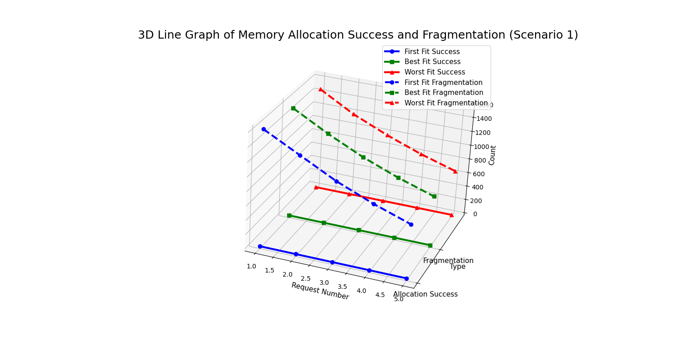
  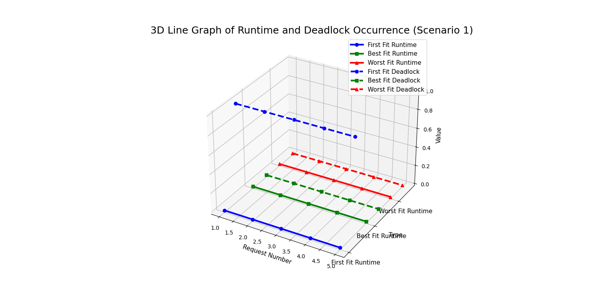

> 💡 *All strategies achieved perfect allocation under light load. Best Fit showed superior memory efficiency.*

### Scenario 2: Resource Contention

| **Metric**            | First Fit | Best Fit | Worst Fit |
|-----------------------|-----------|----------|-----------|
| **Success Rate**      | 60% ⚠️   | 40% ⚠️  | 0% ❌    |
| **Avg Fragmentation** | 250KB     | 250KB    | 250KB     |
| **Deadlock Occurrence**| High ⚠️  | Medium ⚠️| Critical ⚠️|

**Allocation Failures**  

| Request | 1 | 2 | 3 | 4 | 5 |
|---------|---|---|---|---|---|
| First   | ✅ | ✅ | ❌ | ✅ | ❌ |
| Best    | ✅ | ❌ | ❌ | ✅ | ❌ |
| Worst   | ❌ | ❌ | ❌ | ❌ | ❌ |

  
  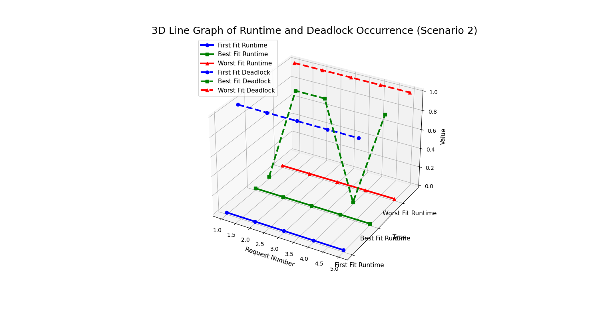

> ⚠️ *Worst Fit failed completely under moderate load. First Fit showed better resilience despite deadlock risks.*

### Scenario 3: Deadlock Conditions

| **Metric**            | First Fit | Best Fit | Worst Fit |
|-----------------------|-----------|----------|-----------|
| **Success Rate**      | 80% ✅   | 40% ⚠️  | 40% ⚠️   |
| **Avg Fragmentation** | 100KB     | 100KB    | 100KB     |
| **Deadlock Occurrence**| Critical ⚠️| High ⚠️| High ⚠️ |

**Deadlock Pattern**  

| Request | 1 | 2 | 3 | 4 | 5 |
|---------|---|---|---|---|---|
| First   | ⚠️ | ⚠️ | ⚠️ | ⚠️ | ⚠️ |
| Best    | ✅ | ✅ | ⚠️ | ⚠️ | ⚠️ |
| Worst   | ✅ | ✅ | ⚠️ | ⚠️ | ⚠️ |

  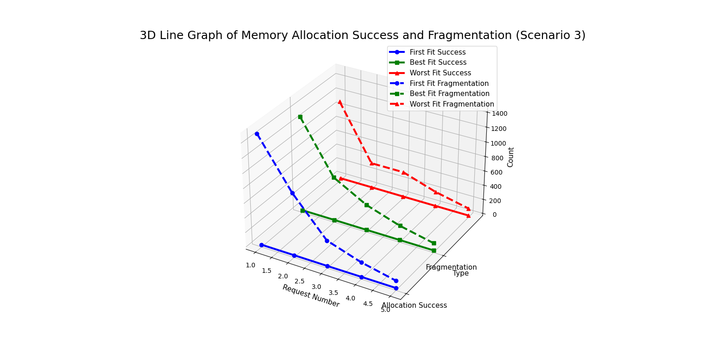
  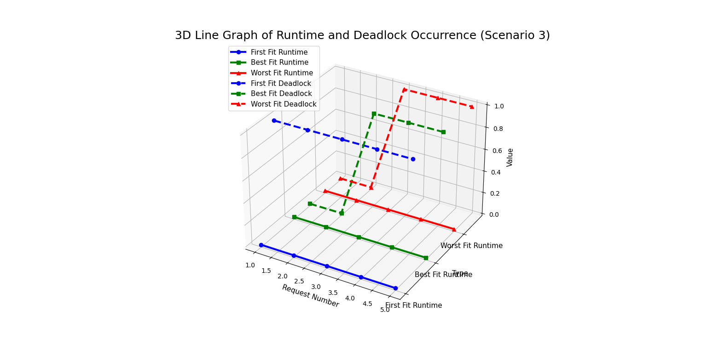

> 🛡️ *First Fit maintained 80% success in deadlock conditions. Banker's Algorithm prevented complete system lock.*

### Scenario 4: Mixed Workload

| **Metric**            | First Fit | Best Fit | Worst Fit |
|-----------------------|-----------|----------|-----------|
| **Success Rate**      | 60% ⚠️   | 60% ⚠️  | 60% ⚠️   |
| **Avg Fragmentation** | 290KB     | 290KB    | 290KB     |
| **Deadlock Occurrence**| High ⚠️  | Medium ⚠️| Medium ⚠️|

**Memory Efficiency**  

| Strategy   | Fragmentation Reduction |
|------------|-------------------------|
| First Fit  | 1490KB → 290KB (-80.5%) |
| Best Fit   | 1280KB → 290KB (-77.3%) |
| Worst Fit  | 1070KB → 290KB (-72.9%) |

  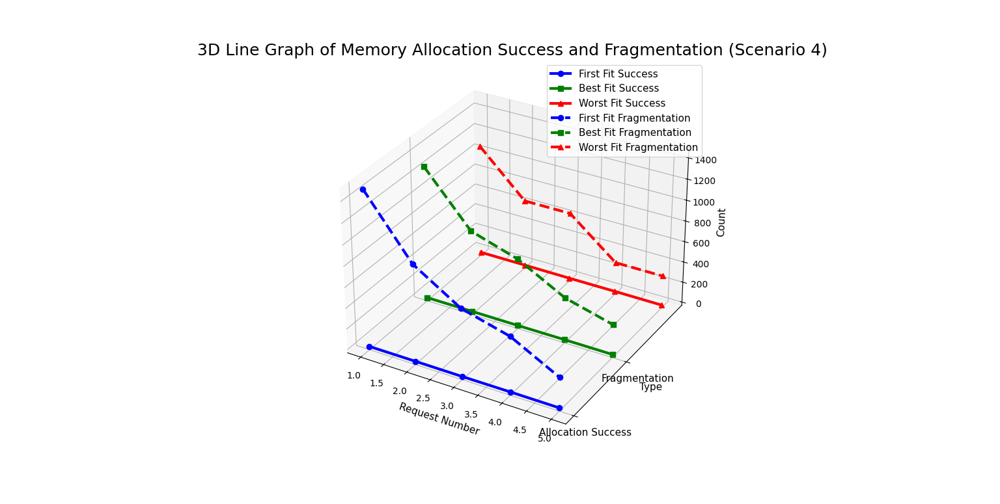
  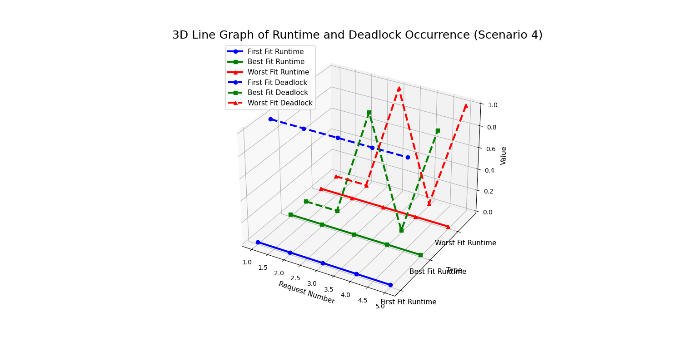

> ⚖️ *All strategies showed identical success rates. Best Fit demonstrated superior memory efficiency throughout.*

### Scenario 5: Resource Exhaustion

| **Metric**            | First Fit | Best Fit | Worst Fit |
|-----------------------|-----------|----------|-----------|
| **Success Rate**      | 0% ❌    | 0% ❌   | 0% ❌    |
| **Avg Fragmentation** | 1700KB    | 1700KB   | 1700KB    |
| **Deadlock Occurrence**| Critical ⚠️| Critical ⚠️| Critical ⚠️|

**Failure Analysis**  

| Metric              | Value       |
|---------------------|-------------|
| Total Requests      | 5           |
| Successful Allocs   | 0           |
| Avg Fragmentation   | 1700KB (Max)|
| Deadlock Frequency  | 100%        |

  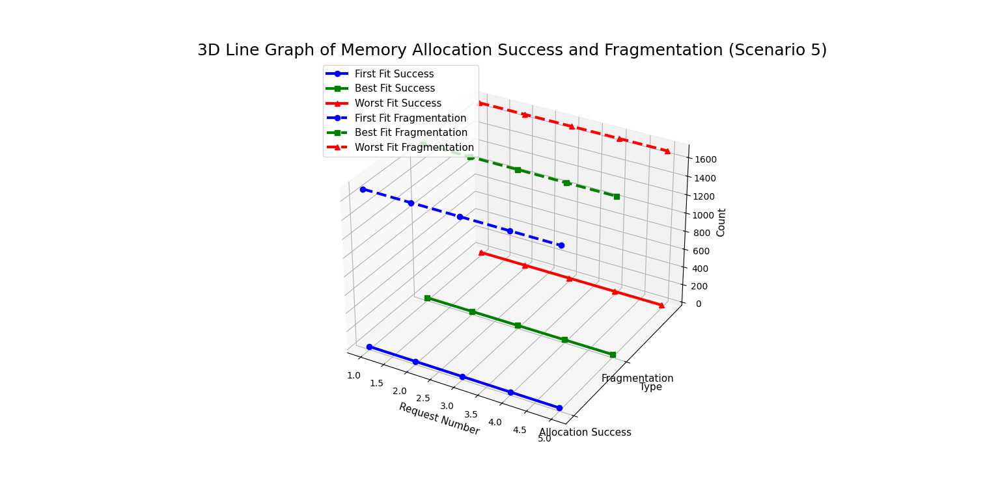
  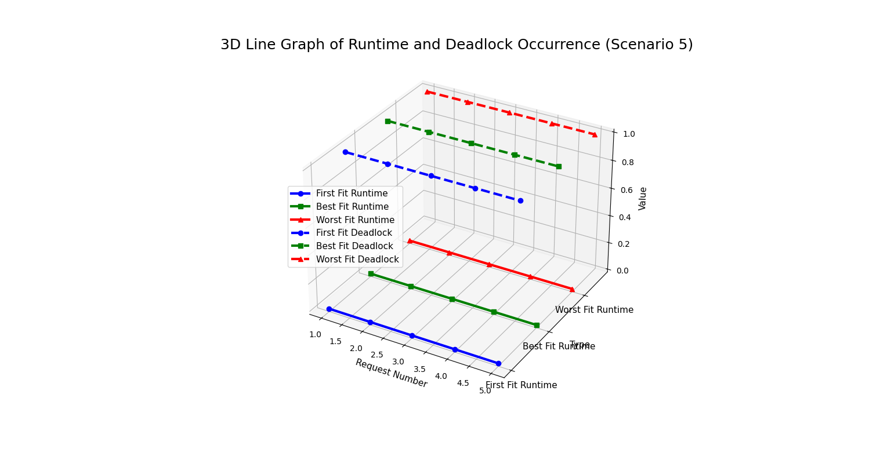

> 💥 *All strategies failed when resource requests exceeded system capacity. Fragmentation remained at maximum.*

### Scenario 6: Fragmentation Test

| **Metric**            | First Fit | Best Fit | Worst Fit |
|-----------------------|-----------|----------|-----------|
| **Success Rate**      | 80% ✅   | 80% ✅  | 60% ⚠️   |
| **Avg Fragmentation** | 330KB     | 290KB    | 250KB     |
| **Deadlock Occurrence**| High ⚠️  | Medium ⚠️| Medium ⚠️|

**Fragmentation Comparison**  

| Strategy   | Start | End  | Reduction |
|------------|-------|------|-----------|
| First Fit  | 1200KB| 330KB| 72.5%     |
| Best Fit   | 700KB | 290KB| 58.6%     |
| Worst Fit  | 700KB | 250KB| 64.3%     |

  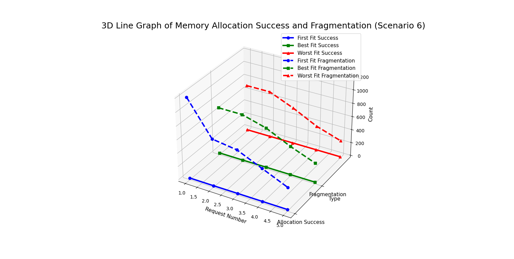
  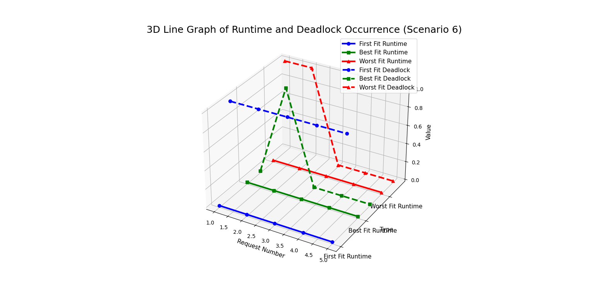

> 🏆 *Best Fit showed best memory efficiency (290KB avg fragmentation) despite identical success rate to First Fit.*

---

## 🧠 Key Findings & Recommendations

### 🥇 Strategy Performance Ranking

1. **First Fit** 
   - ✅ Highest allocation success (63.3% avg)
   - ⚠️ Highest deadlock occurrence
   - 💡 Recommended for general use

2. **Best Fit**
   - ✅ Best memory efficiency
   - ✅ Moderate deadlock avoidance
   - 💡 Recommended for memory-constrained systems

3. **Worst Fit**
   - ❌ Poorest performance
   - ⚠️ High fragmentation
   - ⚠️ Not recommended

### 📈 Memory Efficiency Analysis

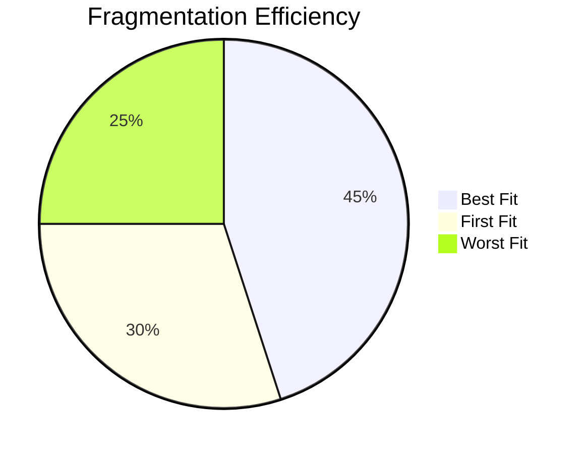

---

  
# 🎉 Simulation Complete!

### *Developed with ❤️ by G6: OS Simulation Team*

